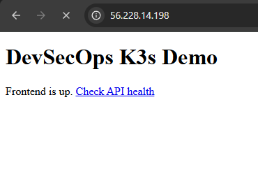
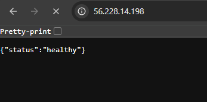
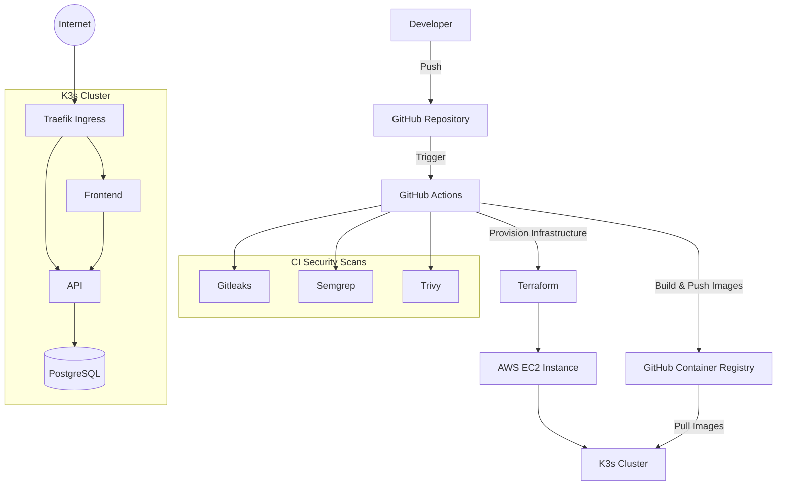
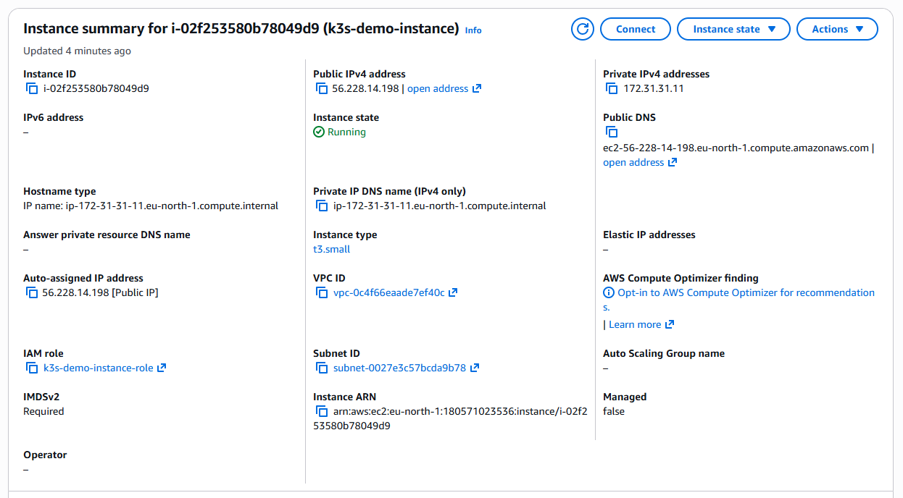
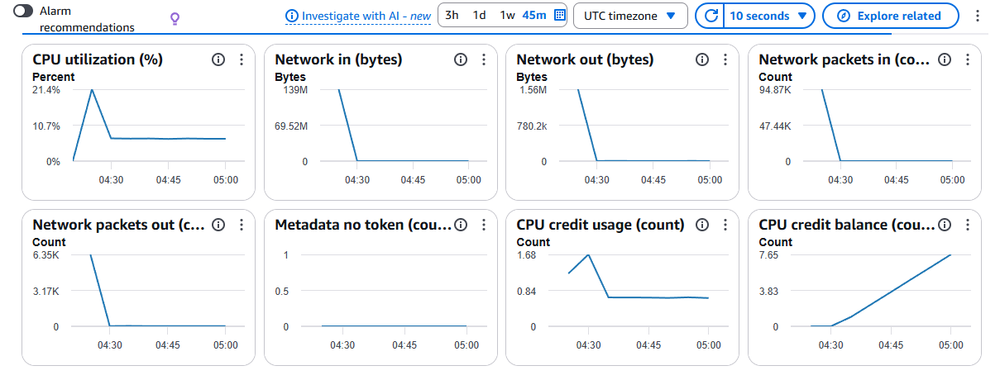
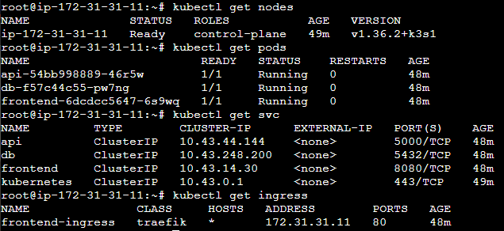
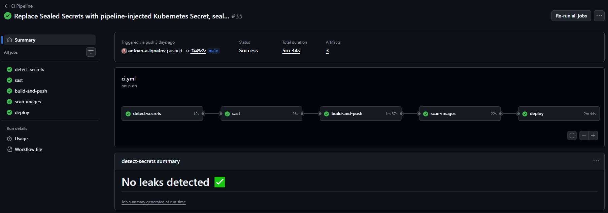

# DevSecOps K3s Migration Demo

## Project Status

[](https://github.com/antoan-a-ignatov/devsecops-k3s-demo/actions/workflows/ci.yml) [](https://github.com/antoan-a-ignatov/devsecops-k3s-demo/releases) [](https://www.docker.com/) [](https://k3s.io/) [](https://developer.hashicorp.com/terraform) [](https://docs.github.com/actions) [](https://aws.amazon.com/)
* **Current Version:** v1.0.0
* **Status:** Functional cloud deployment complete






## Introduction
This project demonstrates the migration of an application from Docker Compose to Kubernetes (K3s) while applying modern DevSecOps practices including infrastructure as code, automated security scanning, supply-chain hardening, and cloud-native deployment. It was built as a portfolio project to showcase practical engineering decisions, troubleshooting, and security trade-offs.
The architecture consists of a three-tier application migrated from Docker Compose to K3s, with a fully automated CI/CD pipeline implementing real DevSecOps controls - secrets detection, static application security testing (SAST), container image scanning, supply-chain pinning, and cloud deployment via Terraform-provisioned infrastructure.

## Table of Contents
1. [Skills Demonstrated](#skills-demonstrated)
2. [Architecture](#architecture)
3. [Repository Structure](#repository-structure)
4. [Docker Compose to K3s Migration](#docker-compose-to-k3s-migration)
5. [Technology Stack](#technology-stack)
6. [Infrastructure](#infrastructure)
7. [CI/CD Pipeline](#cicd-pipeline)
8. [Security](#security)
9. [Engineering Challenges and Design Decisions](#engineering-challenges-and-design-decisions)
10. [Planned Improvements](#planned-improvements)

## Skills Demonstrated

| Area | Implementation |
| :--- | :--- |
| Docker and Docker Compose | Three-tier application built and validated locally with Compose before migration |
| Compose to Kubernetes migration | Converted with Kompose, then reviewed and corrected manually by hand |
| K3s | Full deployment, debugging, and incident recovery on a real cluster |
| Cloud deployment | EC2 instance provisioned per pipeline run via Terraform, destroyed after demo completion |
| CI/CD pipeline | GitHub Actions orchestrating a sequential flow from secrets scanning and SAST to build, image scanning, and deployment |
| Container hardening | Multi-stage Dockerfiles, non-root users, dropped Linux capabilities, and Kubernetes securityContext configurations |
| Secrets management | Pipeline-injected Kubernetes Secrets from GitHub Secrets, never committed to version control |
| Network security | NetworkPolicy restricting database access to the API pod only, enforced by the K3s embedded kube-router controller |
| Supply-chain security | All GitHub Actions pinned to immutable 40-character commit SHAs |
| Deployment automation | Liveness and readiness probes along with resource requests and limits applied to every container |
| Troubleshooting | Real K3s cluster failures diagnosed and resolved systematically |

## Architecture
All three tiers run as separate Deployments and Services on K3s. In the CI/CD environment, the cluster is provisioned on a t3.small EC2 instance via Terraform. The kubeconfig is pushed to AWS Systems Manager Parameter Store so the pipeline can execute deployments without exposing the K3s API publicly during the build process. Locally, the cluster runs within WSL2.



## Repository Structure
The project repository uses the following directory layout:

```text
.
├── .github/
│   └── workflows/          # GitHub Actions CI/CD pipeline
├── app/                    # Application source code
├── docs/
│   └── images/             # README screenshots and diagrams
├── k8s/                    # Kubernetes manifests
├── terraform/              # Infrastructure as Code
├── .gitignore
├── docker-compose.yml      # Original Docker Compose deployment
└── README.md
```

## Docker Compose to K3s Migration
While Kompose handles the mechanical conversion process, the generated output required human review and manual corrections before deployment:

1. **Plaintext Password Exposure:** Kompose resolved the environment variables at conversion time and wrote the actual plaintext password into the generated Deployment manifest. This was caught before the first commit and replaced with a proper Kubernetes Secret reference.
2. **Missing Kubernetes Services:** Kompose only creates a Service for containers that contain an explicit ports block. The API and database tiers relied on internal Docker DNS within Compose and lacked explicit ports, causing Kompose to skip Service generation entirely. These Services were added manually.
3. **Image Pull Policy Adjustments:** Kompose assumes images always originate from a remote registry. Local images were imported directly into the containerd store of K3s using imagePullPolicy: Never during early local testing. In the automated pipeline, images are built, pushed to GHCR, and the production manifests reference those registry images.

## Technology Stack

### Technologies Used
* **Containerization and Orchestration:** Docker, Docker Compose, Kompose, Kubernetes, K3s
* **Ingress and Networking:** Traefik
* **Application and Database:** Flask, Nginx, PostgreSQL 16
* **CI/CD and Automation:** GitHub Actions, Helm
* **Security Scanning:** Gitleaks, Semgrep, Trivy
* **Infrastructure as Code:** Terraform
* **Cloud Platform:** AWS (EC2, S3, Systems Manager Parameter Store)
* **Container Registry:** GitHub Container Registry (GHCR)

### Technologies Evaluated
* **Sealed Secrets:** Evaluated and implemented during development, but deliberately excluded from the final production architecture due to the ephemeral nature of the cluster.

## Infrastructure
The cloud cluster is completely managed via Terraform, including the EC2 instance, security groups, IAM roles, and instance profiles. The IAM role is tightly scoped, allowing it to only write the kubeconfig to a single AWS Systems Manager Parameter Store path. State is stored in an S3 bucket so that local runs and the pipeline maintain a unified view of the active infrastructure.

The automated boot script performs the following tasks:
* Installs the AWS CLI, K3s (with control-plane flags tuned for resource-constrained environments), and Helm.
* Pushes the kubeconfig to Parameter Store using IMDSv2 for secure metadata retrieval.
* Substitutes the public IP into the kubeconfig before uploading so external automated tools can establish a connection.

The instance is short-lived by design, provisioned specifically for a demo or a pipeline run and then destroyed immediately after.





## CI/CD Pipeline
The pipeline triggers on every push to main and every pull request. Stages execute sequentially, with each stage acting as a quality gate for the next. 

The deployment job provisions a fresh EC2 instance or reuses an existing one via Terraform, waits for K3s to finish booting, and verifies that the kubeconfig IP matches the new instance before attempting a connection. It then creates the database Secret from a GitHub Secret and applies the Kubernetes manifests. 

The K3s API port (6443) is opened to all traffic exclusively for the duration of this step. It is immediately closed by a final cleanup step running with an absolute execution rule, ensuring security enforcement even if the deployment fails. Images are tagged with both the latest tag and the exact commit SHA, linking every deployed artifact directly to an auditable point in git history.



## Security

### Security Architecture
* **Network Isolation:** A NetworkPolicy restricts database access to the API pod only. This prevents lateral movement if the API pod is compromised. It is enforced natively out of the box by the embedded kube-router controller in K3s and validated via live traffic testing.
* **API Exposure Mitigation:** The K3s API port (6443) is closed by default in the AWS security group. The deployment job opens access to all traffic only during the deployment step, tightening it down immediately afterward. This approach addresses the limitation where GitHub hosted runner IP ranges exceed AWS security group rule limits. The API remains fully protected by client certificate authentication via the kubeconfig, which serves as the actual access control.

### Hardening
* **Privilege Escalation Prevention:** Application containers utilize explicit `securityContext` configurations to prevent privilege escalation. API and database containers run as verified non-root UIDs, which was confirmed by direct image inspection. All Linux capabilities are dropped by default, and only essential ones are added back.
* **Nginx Special Handling:** The Nginx master process must start as root to bind to port 80 before dropping privileges internally. This prevents the enforcement of a pod-level non-root requirement during startup. To maintain security, necessary capabilities (NET_BIND_SERVICE, CHOWN, SETUID, SETGID) are explicitly added back, while all other capabilities remain dropped.
* **Postgres Volume Access:** K3s uses local-path-provisioner, backing volumes with plain hostPath directories on the node. Because the fsGroup setting does not apply to hostPath volumes, a root-owned directory causes Postgres initialization to fail. An init container running as root modifies the directory ownership via chown before the main Postgres container starts, allowing Postgres to run securely as a non-root user.
* **Supply-Chain Hardening:** All actions within the GitHub Actions workflow are pinned to immutable 40-character commit SHAs instead of mutable tags, preventing untrusted upstream modifications from compromising the pipeline. Human-readable tags are preserved alongside the SHAs as comments.
* **Resource Constraints:** Every container is configured with explicit CPU and memory requests and limits to ensure stability and prevent resource exhaustion on the cluster.

### Secrets Management
The database password is kept securely as a GitHub Secret and injected directly as a Kubernetes Secret by the pipeline during deployment. It is never written to disk within the repository or exposed in git history. This model introduces a trade-off: the secret must be regenerated during every infrastructure recreation cycle, which is an accepted characteristic of utilizing ephemeral infrastructure patterns.

### Pipeline Findings
Running active security scanners against the application code, Kubernetes manifests, GitHub Actions workflows, and container images surfaced genuine findings rather than producing a clean report by default. These findings were investigated, documented, and either remediated or consciously accepted based on their impact and the project's goals.

#### Semgrep (SAST)
* `python.flask.security.audit.app-run-param-config.avoid_app_run_with_bad_host`: Flagged the use of `app.run(host="0.0.0.0")` in the Flask API. This was assessed as a false positive in this specific environment, as the container operates in an isolated pod network namespace and binding to all interfaces is required for the Kubernetes Service to route traffic to it. This finding is suppressed inline with a `nosemgrep` comment and a documented explanation.
* `yaml.kubernetes.security.run-as-non-root.run-as-non-root`: Flagged `frontend-deployment.yaml` for missing a pod-level non-root setting. This is intentional, as the Nginx master process requires root access to bind port 80. This rule is excluded at the pipeline level using `--exclude-rule`, with the rationale documented here due to YAML syntax layout constraints.
* `github-actions-mutable-action-tag`: Flagged actions using mutable version tags. This was resolved by pinning all actions to their definitive commit SHAs.

#### Trivy (Container Image Scanning)
* **API Image (`python:3.12-slim`):** Identified 11 findings in base Debian OS packages (perl, ncurses, sqlite) that the application does not consume. These carried an affected or deferred status with no upstream patches available. They were handled using `ignore-unfixed: true`, ensuring the pipeline blocks only on actionable vulnerabilities. Alpine was rejected as an alternative because `psycopg2-binary` uses glibc-only wheels, which would make Alpine builds slow and fragile.
* **Frontend Image (`nginx:1.27-alpine`):** Detected 33 findings in standard libraries (OpenSSL, libxml2, libpng, zlib) due to an outdated base image. This was resolved by adding `RUN apk update && apk upgrade --no-cache` to the Dockerfile to pull current patched packages during the build phase, resulting in a clean scan.
* **Database Image (`postgres:16-alpine`):** Found 16 vulnerabilities embedded within the Go standard library by upstream maintainers, including a critical TLS issue. These cannot be patched via package managers and exist inside the official unmodified image. The step uses `continue-on-error: true` to prevent blocking deployments on unfixable upstream bugs, tracking this as an accepted operational risk.

#### Gitleaks (Secrets Detection)
* **Status:** Zero findings. Verifies that no sensitive credentials or database passwords entered git history at any point during development.

## Engineering Challenges and Design Decisions

### K3s Crash-Loop on WSL2 Restart
During development, K3s entered a persistent crash-loop following a WSL2 restart, failing an internal RBAC bootstrap sequence with vague log output. After ruling out disk space issues and datastore corruption, the root cause was traced to an outdated WSL2 kernel. The issue was resolved by running `wsl --update`, performing a clean reinstall of K3s, and refreshing the local kubeconfig.

### CPU Credit Exhaustion on Burstable Instances
Initial testing utilized a free-tier t3.micro instance (1 vCPU, 1 GB RAM). The K3s control plane consumed roughly 75 percent of the available CPU at steady state, rapidly exhausting the burstable instance baseline during extended testing sessions. This caused the AWS Systems Manager agent to hibernate and caused kubectl commands to hang indefinitely. The infrastructure was upgraded to a t3.small instance (2 vCPU, 2 GB RAM), matching the minimum documented resource requirements for a stable K3s server node.

### Sealed Secrets and Ephemeral Clusters
The Sealed Secrets controller was implemented and tested, but subsequently removed from the architecture. The controller generates a unique encryption key pair upon installation. In a destroy-and-recreate deployment pattern, all previously sealed secrets become permanently unreadable after a cluster rebuild. While Sealed Secrets is an excellent choice for long-lived clusters managed by GitOps engines like Argo CD or Flux, it creates unnecessary overhead in short-lived environments. The architecture shifted to pipeline-injected secrets from GitHub Secrets to align with the ephemeral infrastructure model.

### hostPath Volumes and Directory Ownership
The Kubernetes `fsGroup` setting does not apply to hostPath-backed volumes, which K3s uses by default via its `local-path-provisioner`. As a result, the Postgres initialization process failed with permission errors when running as a non-root user against a root-owned directory. This was resolved by introducing a root-configured init container that runs a chown command on the shared volume directory before handing off control to the unprivileged main Postgres container.

## Planned Improvements
* Implement image signing using Cosign.
* Generate Software Bill of Materials (SBOM) tracking using `trivy sbom`.
* Package application manifests into a unified Helm chart.
* Establish OIDC federation for AWS authentication to eliminate long-lived access keys in GitHub Secrets.
* Enforce admission policies using Open Policy Agent (OPA) or Kyverno.
* Design a structured promotion flow spanning distinct staging and production namespaces.
